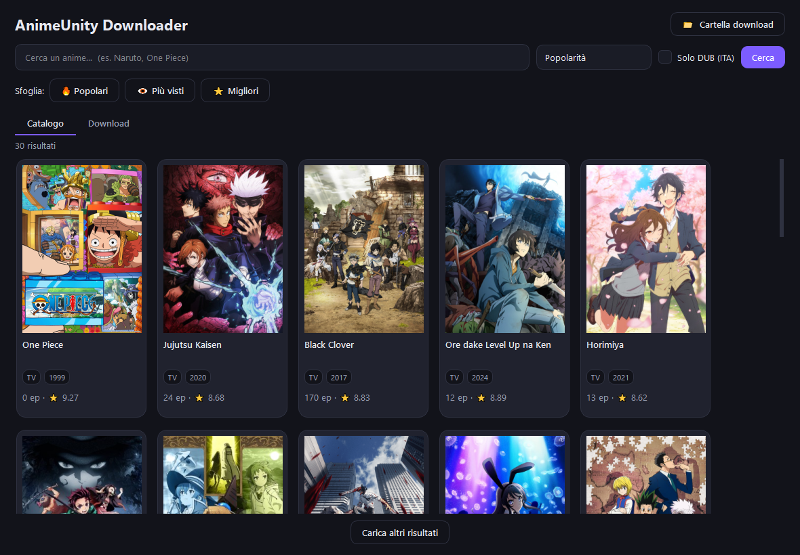
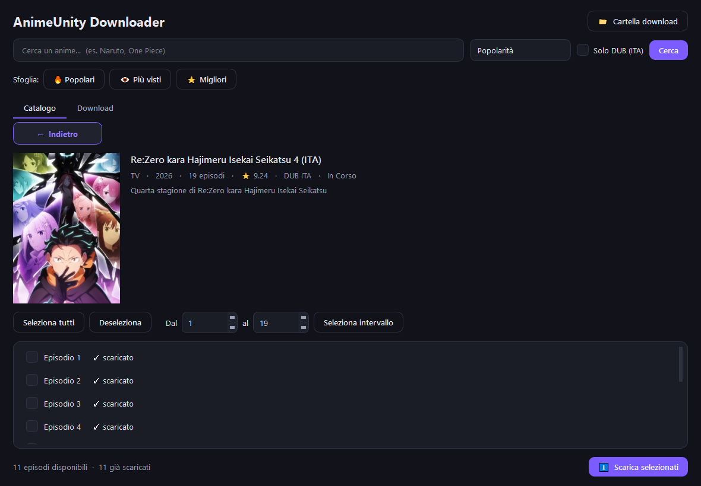
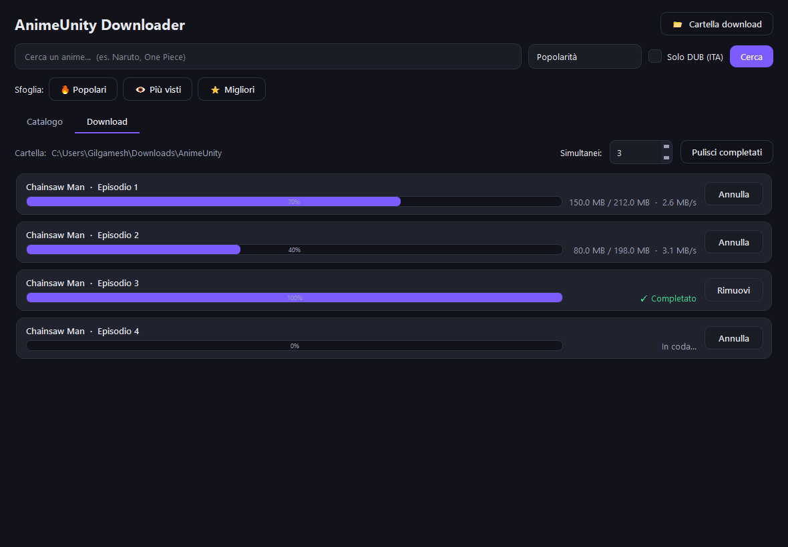

<p align="center">
  
</p>

<h1 align="center">AnimeUnity Downloader</h1>

<p align="center">
  App <b>desktop</b> per cercare e scaricare anime da
  <a href="https://www.animeunity.so">AnimeUnity</a> — tutto a click,
  <b>senza terminale e senza comandi Python</b>.
</p>

---

## 📸 Anteprima

<p align="center">
  
</p>

<p align="center">
  
  &nbsp;
  
</p>

## ✨ Caratteristiche

- 🔎 **Ricerca** anime per titolo, collegata direttamente al sito.
- 🔥 **Sfoglia** il catalogo: *Popolari*, *Più visti*, *Migliori*.
- 🇮🇹 Filtro **DUB (ITA)** per i soli anime doppiati in italiano.
- 📺 Scheda anime con **trama, copertina e lista episodi**.
- ✅ Selezione episodi: **singoli**, **tutti** o **intervallo** (es. dal 5 al 12).
- 📥 **Coda di download** con barra di avanzamento, velocità, download **simultanei**
  regolabili, **annulla** immediato e **cartella personalizzabile**.
- ⏯️ **Ripresa dei download interrotti**: se un download viene interrotto, riparte da
  dove si era fermato invece che da capo. Nella lista episodi vedi quali sono già
  scaricati (✓) e quali sono da completare (⏸).
- 💾 File salvati in modo ordinato: `Nome Anime - Ep 01 [1080p].mp4`.

## ⬇️ Installazione e avvio

### Modo più semplice — eseguibile (consigliato)

1. Vai alla pagina **[Releases](https://github.com/piciolo/AnimeUnityDownloader/releases/latest)**
   e scarica il file `.exe`.
2. **Doppio clic**. Fine: non serve installare Python.

> Essendo un eseguibile non firmato, Windows SmartScreen potrebbe mostrare un avviso:
> clicca **Ulteriori informazioni → Esegui comunque**. Al primo avvio l'app impiega
> qualche secondo a partire.

### Avvio con doppio clic (dal codice, senza creare l'exe)

Fai doppio clic su **`Avvia AnimeUnity.bat`** (avvia l'app senza finestra del terminale).
Richiede Python con le dipendenze installate (vedi sotto).

### Da sorgente

```bash
pip install -r requirements.txt
python app.py
```

## 🕹️ Come si usa

1. All'avvio vedi già gli anime **Popolari**.
2. Scrivi un titolo nella barra e premi **Invio** (o **Cerca**). Puoi cambiare
   l'ordinamento e attivare **Solo DUB (ITA)**.
3. Clicca su una copertina per aprire la **scheda dell'anime**.
4. Spunta gli episodi desiderati. Per fare presto usa **Seleziona tutti** oppure imposta
   **Dal … al …** e premi **Seleziona intervallo**.
5. Premi **⬇ Scarica selezionati**: passi automaticamente alla scheda **Download**.
6. Nella scheda **Download** segui l'avanzamento; puoi **annullare** un download in corso
   o **rimuovere** quelli finiti, e regolare i download **simultanei**.

## 💾 Dove finiscono i file

I video vengono salvati nella cartella di download scelta (modificabile dall'app),
dentro una sottocartella con il nome dell'anime, ad esempio:

```
<cartella scelta>/
└── Chainsaw Man/
    ├── Chainsaw Man - Ep 01 [1080p].mp4
    └── Chainsaw Man - Ep 02 [1080p].mp4
```

Riavviando un download già presente, l'episodio viene riconosciuto e saltato.

## 🔨 Creare l'eseguibile

Per generare tu stesso il `.exe` (serve solo la prima volta):

```bash
pip install pyinstaller
python build_exe.py
```

Al termine trovi **`dist/AnimeUnity Downloader.exe`**: un singolo file portabile,
lanciabile con un doppio clic anche su PC senza Python.

> Per un'icona personalizzata, metti un file `assets/logo.ico` prima di lanciare
> `build_exe.py`.

## ⚙️ Come funziona (in breve)

L'app è autonoma (pacchetto `gui/` + `app.py`) e comunica direttamente con AnimeUnity:

- ricerca/catalogo tramite l'endpoint `POST /archivio/get-animes` (con token CSRF);
- lista episodi tramite `info_api`;
- link diretto al file `.mp4` estratto dalla pagina video dell'episodio.

I download vengono eseguiti in thread separati per non bloccare l'interfaccia.

## 📦 Requisiti

- Per l'**eseguibile**: nessuno (Windows 64 bit).
- Per l'**avvio da sorgente**: Python 3.10+ con `PySide6` e `httpx`
  (`pip install -r requirements.txt`).

## ⚠️ Note

Strumento pensato per **uso personale**. Rispetta le leggi sul diritto d'autore e i
termini di servizio del sito: scarica solo contenuti per cui hai i relativi diritti.

## 📄 Licenza

Distribuito secondo i termini indicati nel file [LICENSE](LICENSE).
